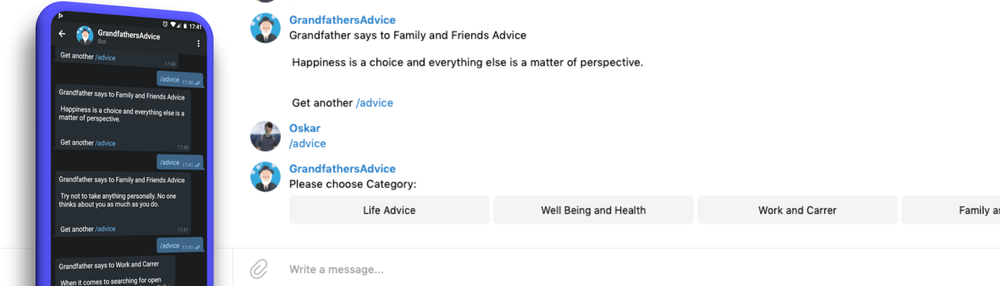

# GrandfathersAdvice Telegram Bot

Grandfather will tell you his Advice he learned throughout his Life. 





[](https://www.python.org/) [](https://camo.githubusercontent.com/16ffa88a35d0857d4db701c510eb3099fbf8d907/68747470733a2f2f696d672e736869656c64732e696f2f6769746875622f6c6963656e73652f4e61657265656e2f5374726170446f776e2e6a732e737667) [](https://camo.githubusercontent.com/d41b9884bd102b525c8fb9a8c3c8d3bbed2b67f0/68747470733a2f2f6261646765732e66726170736f66742e636f6d2f6f732f76312f6f70656e2d736f757263652e7376673f763d313033)


Click the Button to get some Advice from Grandfather:

[]( https://t.me/GrandfathersAdviceBot)


## Features

* Life Advice
* Well Being and Health Advice
* Work and Carrer Advice
* Family and Friends Advice


## Install

```bash
git clone https://github.com/daehruoydeef/GrandfathersAdviceBot
cd GrandfathersAdviceBot
pip3 install -r requirements.txt
python3 main.py
```

Note: This will not run by default you first need to get a Token by the Botfather himself. See [here](https://core.telegram.org/bots#3-how-do-i-create-a-bot). You need to edit 

## Contributing

### Adding Advice

You feel like Advice is missing in the Database? Feel free to open up an Issue with the Advice you would like to be added


## License

MIT